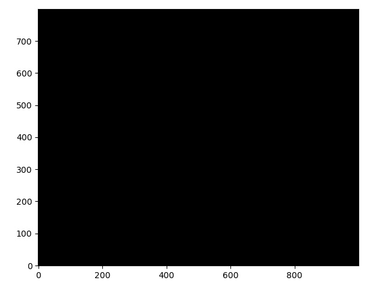

# Sersic_Galaxies
Simulation of an image of galaxies with Sersic profile (https://en.wikipedia.org/wiki/Sersic_profile) and a Poisson distribution for the shot (background) noise. Using AstroPy and Photutils.

